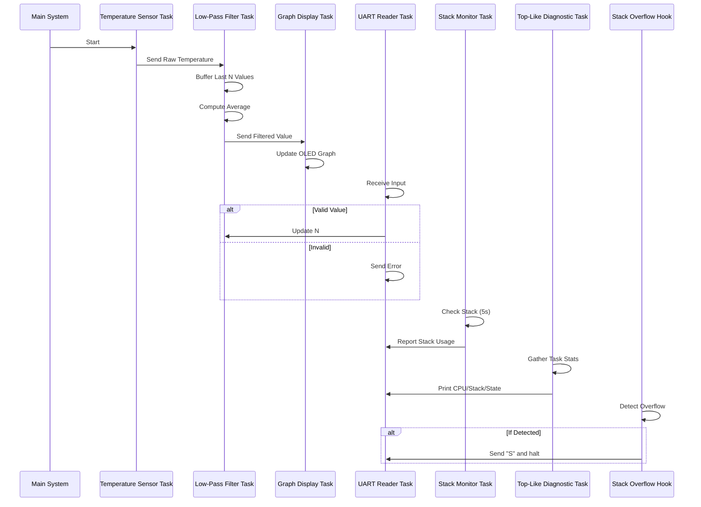

---

# **Real-Time Temperature Monitoring System Using FreeRTOS**

## **Introduction**

This report describes the design and implementation of a **real-time temperature monitoring system** developed on the **Stellaris LM3S811 microcontroller**, leveraging **FreeRTOS** for multitasking and inter-task communication. The system simulates temperature acquisition, applies a configurable **low-pass filter**, and presents filtered data on a **96×16 OLED display**. It also supports **real-time user interaction via UART**, and includes system diagnostics inspired by the Linux `top` utility. All development and testing were conducted in a **QEMU-based simulation environment**.

---

## **System Configuration**

The system runs on an embedded platform with the following configuration:

* **Target MCU**: Stellaris LM3S811
* **Simulation Environment**: QEMU
* **RTOS**: FreeRTOS
* **Communication Interface**: UART0 @ 115200 baud
* **Display**: 96×16 OLED (OSRAM)

---

## **Data Flow Overview**

The application implements a modular task structure, where each task fulfills a well-defined role in the data processing pipeline:

1. **Sensor Simulation**
2. **Filtering**
3. **Visualization**
4. **User Interaction**
5. **System Diagnostics**

---

### **Temperature Sensor Simulation**

The `vSimulateTemperatureSensorTask` generates synthetic temperature values in the **15–35°C** range using a pseudo-random function. These values are sent to `xRawTemperatureQueue` for downstream processing. The task runs at **10 Hz** (every 100 ms), simulating a realistic sampling frequency.

---

### **Low-Pass Filtering**

To mitigate noise in the raw readings, the `vLowPassFilterTask` implements a **moving average filter** using a **circular buffer** of configurable size `N`. The buffer is dynamically allocated with `pvPortMalloc()`.

* **Filtering Algorithm**: Simple arithmetic mean over the last `N` samples
* **Dynamic Reconfiguration**: The window size `N` can be updated in real time via UART input
* **Output**: Filtered values are sent to `xFilteredDataQueue`

---

### **Graphical Display Task**

The `vDisplayGraphTask` visualizes the filtered data by scaling it to a **16-pixel vertical resolution** and plotting it on a 96×16 OLED screen. The graph scrolls horizontally, providing a time-series view of temperature trends in real time.

---

## **User Interaction via UART**

The `vUARTReaderTask` enables user-driven configuration of the filter's window size by accepting values between **2 and 10** over UART. It provides immediate feedback and validation through UART output, and updates the shared `filter_window_size` variable accordingly.

---

## **Diagnostics and Monitoring**

### **Stack Usage Tracking**

The `vMonitorStackTask` invokes `uxTaskGetStackHighWaterMark()` to report stack utilization for each task every **5 seconds**. This helps ensure that tasks are not approaching stack exhaustion.

---

### **System Load Monitoring (`Top`-Like Task)**

The `vTopLikeTask` periodically gathers and displays runtime diagnostics via UART, emulating the functionality of the Unix `top` tool. It reports:

* Task name
* CPU usage (%)
* Stack high water mark
* Task state (e.g., Running, Blocked, Ready)

It uses `uxTaskGetSystemState()` and `xPortGetFreeHeapSize()` to retrieve runtime statistics and detect low-memory conditions.

---

### **Stack Overflow Protection**

FreeRTOS’s hook `vApplicationStackOverflowHook()` is implemented to detect stack overflows. Upon detection, the system sends an `'S'` character via UART and halts, enabling early detection during development.

---

## **Debugging and Simulation with QEMU**

The system was fully developed and tested using **QEMU**, leveraging UART as a primary interface for logs, telemetry, and user input. To minimize UART congestion during testing, verbose output from tasks (e.g., raw/filtered values) was suppressed in the final version to preserve clarity for diagnostics emitted by the `vTopLikeTask`.

---

## **Task Interaction Diagram**

---

## **Conclusion**

This project successfully demonstrates a **modular, multitasking real-time system** on an embedded platform using FreeRTOS. It features:

* Real-time sensor simulation and filtering
* Interactive parameter tuning via UART
* Real-time graphical feedback
* Comprehensive system diagnostics

Through QEMU simulation, the system was validated without hardware, ensuring **portability, debuggability, and memory efficiency**. Emphasis was placed on **inter-task communication, stack usage monitoring, and safe memory allocation**, resulting in a **robust and adaptable design** suitable for educational or prototyping applications.

---